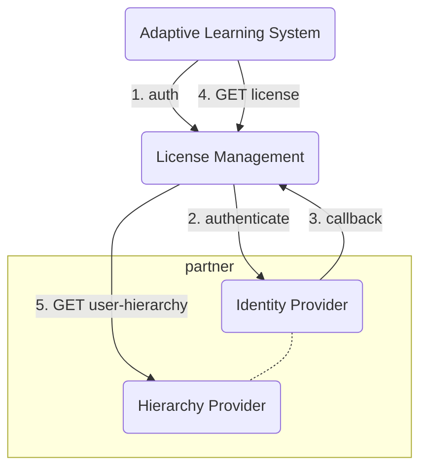

# license-manager-POC
A POC for a generic License Manager ...

## Concept
The concept for implementing such a License Manager can be found here:
[License Manager concept](./docs/concept.md)

## Data Model
This is the currently imple,ented data model:
[License Manager data model](./docs/license-manager-ERD-2023-02-12.svg)

## Installation
Create a 'dotenv' file:
Create a file named '.env' in the root folder of the app and provide your database paramaters and credentials like so:

```
DATABASE_USER=<<your 'postgres' user name (root user of the RDBMS)>>
DATABASE_PASSWORD=<<your 'postgres' users (root user of the RDBMS) password>>
DATABASE_HOST="localhost"
DATABASE_PORT="5432"
DATABASE_NAME=<<the name of the 'license-manager' database you will create in the following step (licm)>>
```
Before you can start the application, you have to install a database. Please create a database manually
on your local postgreSQL database using the SQL query

```sql
CREATE DATABASE licm;
```

Alternatively, you can run the whole application in a Docker container.
In order to build and start the container, just use the command

```sh
docker compose up -d --build
```

## Application Start (DEV)
You can start the application using the following commands:
```sh
cd <license-manager-POC>
export PYTHONPATH=$PWD/src
uvicorn licensing.main:app --reload --workers 1 --host 0.0.0.0 --port 8000
```

You can now use the API:

(If you run the app in docker container)
* API docs: http://localhost:8002/docs
* license API: http://localhost:8002/licenses

(If you run the app by not using Docker)
* API docs: http://localhost:8000/docs
* license API: http://localhost:8000/licenses

## Migrations with 'alembic'

* generate new migrations:
    ```sh
    alembic revision --autogenerate -m "<some meaningful title>"
    ```

* apply the migrations:
    ```sh
    alembic upgrade head
    ```

## Authentication

### Student/Teacher get license


1. A user needs to authenticate against `License Management` to get access to the API
2. Establish authentication against `Identity Provider`
   - When there is no active session yet a login form of the `Identity Provider` is shown
   - When there is an active session the user accepts access from bettermarks to userinfo/hierachies
3. In the callback the `License Manger` receives an Access Token for the `Hierarchy Provider` API
4. User has access to protected APIs of `License Manager` and `Hierarchy Provider`