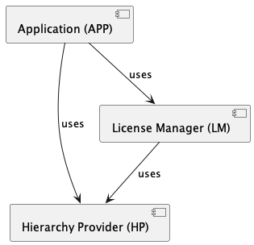

# License Manager Concept

The License Manager (LM) is basically some Rest API. The LM API accepts and handles

* requests from authenticated users to buy (get) licenses
* requests from authenticated users to (implicitly) redeem a
  license and get permissions to access some (connected) application

## Components

The LM works in some 'integrated' environment, which is made of

* an Application (APP) (in our case the 'bettermarks application'), where
  users can do something
* a Hierarchy Provider (HP), which holds entity hierarchies (for more on hierarchies, see below).
  HP is usually bundled with an Identity Provider (IDP)
* the License Manager (LM) itself.



Components of the 'license featured' application

## Entities and Hierarchies

We call users, school classes, schools, other organisational structures, even
countries 'Entities' (E). Those entities can be arranged in some 'natural' hierarchy,
e.g. some school has several classes, each of those classes has several students and
one (or maybe more) teachers. An entity is uniquely identified within the HP by some
identifier, we call it 'external identifier' (EID).

The Hierarchy Provider (HP) stores those entities and their hierarchical relations.

## The Hierarchy Provider
The HP is also an API, where authenticated users
or other services as Clients can get information about hierarchies of specific
entities. In order to fulfill the requirements for some environment including an LM,
the following routes must be implemented by an HP:

### Getting Hierarchy Levels
```
GET /hierarchy/levels
```
This route returns the hierarchy levels, that are used in the specific
hierarchy structure of the domain. Those hierarchy levels are used to
identify entities, which are associated with some given hierarchy level
(see below). A call to the route returns something like
```json
{
    "student": 0, 
    "teacher": 0, 
    "class": 1, 
    "school": 2
}
```
There are two 'leaf levels' defined, 'teacher' and 'student' entity, a 'level 1'
entity named 'class' and a 'level 2' entity named 'school'.

### Getting all 'Memberships' for a Specific User
```
GET /hierarchy/users/{user EID}/membership
```
This route gets all the memberships of a given user including the user themselves and returns something like
```json
[
    "(school)(999)",
    "(school(888)",
    "(class)(344)",
    "(class)(566)",
    "(teacher)(glu::123)"
]
```
This means that a user 'glu::123' (who is associated with a 
hierarchy level 'teacher') is currently member of a hierarchy level
named 'class' and has EID='344' and of some 'class' with EID='566',
which both are 'located' in some hierarchy level 'school' with EID='999'.
Additionally, 'teacher' 'glu:123' is also member of school '888'.

## The License Manager
The LM is also some web service, that implements a couple of routes
that can be used by the users of the application. The 'links' representing
the web service calls are provided to the users by the application. We are currently
implementing a POC for such routes. We will implement the following routes:

### Getting Products
This route returns all 'available products'. For the POC, there is just one product, that is associated with
'full access'. Fine granular permissions within a product are not dealt with in the POC. But we already know, that
the place, where to define specific permissions (e.g. permissions to have access to specific books), is the
'product'.
```
GET /products
```
would return something like
```json
[
 {"eid": "full_access", "name": "Full access to bettermarks"} 
]
```

### Purchasing a License
The process of purchasing a license will be a multistep process (getting pricing information, add a license product
with number of seats and duration to a 'shopping cart', purchase ...). We will not implement such a multistep process
in the POC, we will just add one route as follows:
```
POST /users/{user EID}/purchases
```
with some request body like
```json
{
  "product_eid": "full_access",
  "owner_hierarchy_level": "class",
  "owner_eids": ["34535356324", "2346445645646"],
  "seats": 50,
  "valid_from": "2023-01-01",
  "valid_to": "2023-12-31",
  "hierarchy_provider_url": "http://0.0.0.0:5001/hierarchy"
}
```
The request body will be interpreted like so: The requesting user wants to add (purchase) a
license for a product with EID='full_access' and an 'entity level' 'class'. He wants to
buy the license to be valid from first of January 2023 to the last of December 2023. The
license should be valid for 50 'seats', that means, that 50 students (and/or teachers? TODO)
can use the license at the same time. The license should be valid for the students
(and teachers? TODO), that are members of classes with EID='34535356324' resp.
EID='2346445645646".

#### What happens when this route is being called:
Let us assume, the purchase function is called via
```
POST /users/1111111/purchases
```
using the request body given above.
The request handling function will perform the following steps:
* Check, if the requesting user (given EID) is loggend in and has issued the request. -> If not, return an error
* Check, if the 'entities' in the request are ALL part of the users 'memberships'. -> If not, return an error
  * In order to check this, the HP (via the URL given in the request body) is called 
    via ```GET /hierarchy/users/1111111/membership```.
    The result would be something like this:
    ```json
    [
      "(school)(999)",
      "(class)(34535356324)",
      "(class)(2346445645646)",
      "(school)(888)",
      "(teacher)(1111111)"
    ]
    ```
    We now apply a simple string search to the result list checking, if ALL entities in the request body have a
    match in the result list AND have correct 'level' (as given in the request body). -> If not, return an error!
    Yes, they have! So the license purchase request is valid in this case!
* The license will be stored in the database like so:
  Create a new row in the 'license' table:

  |license ID|product EID|purchaser EID| owner hierarchy level | owner EIDs|seats|start|end|
  |-----------|-------|-----------------------|------------|--------|-----|-----|-----| 
  |1|full_access|1111111| class                 |['34535356324','2346445645646']|50|2023-01-01|2023-12-31| 

* Some information about successful purchase of the license will be returned to the requesting user.

### Implicit Redeeming a License and Getting Permissions
After each login to the APP, some call to the LM should follow directly after login (via redirect or by
using some other mechanism). Using the route
```
GET /users/{user EID}/permissions
```
without any parameters (TODO: is this really a GET request?) would check for the permissions of the given user
and implicitly redeem, if NO license seat can be found for this user. 

We are facing four different use cases here:

1. The case 'user does not have a seat yet, but can occupy one' (has been described above)
2. The case 'user has already occupied a seat and the license AND the hierarchy structure for the user is still valid'
3. The case 'user has a seat', but hte license has expired.
4. The case 'user has a seat, but no longer fulfills the hierarchy criteria'

Case 1 will be described below, cases 2, 3, and 4 can be implemented in a similar way and will not be 
described explicitly here.

#### What happens when this route is being called:
Let us assume, that the calling student with EID='123456789' is member of the class with EID='34535356324', for which
the (teacher) with EID='1111111' already purchased a license. The student logs in for the first time. So, the student
will call the following route (implicitly) from the APP:
```
GET /users/123456789/permissions
```
The request handling function will perform these steps:
* Check, if the requesting user (given EID) is loggend in and has issued the request. -> If not, return an error
* Now, the evaluating function would query the license seats table, if there is already a seat 'taken' by the
  requesting student. The table 'seat' could currently look like this:

  | license ID | user EID |created|  
  |-----------|------|--------| 
  |1|777777|2023-01-05| 

  Using a query like
  ```sql
  SELECT 
     lic.product_eid 
  FROM 
     license_seat s
     INNER JOIN license l ON l.license_id = s.license_id
  WHERE
     s.user_eid = '123456789' 
  ```
  The query returns no product, therefore we have to go to the next step. If the query would have got a result,
  we also would go to the next step, as we maybe have to 'free a seat'. (The latter 'free a seat' use case will 
  not be described here, also the case 'seat is still valid' and license seat is expired')

* Send a new request to the HP: ```GET /hierarchy/users/123456789/membership```.
  The result would be something like this:
  ```json
  [
    "(school)(999)",
    "(class)(2346445645646)",
    "(student)(123456789)"
  ]
  ```
  We will now look up all those 'memberships' in the license table using some simple query 
  (not written down here) and we will have a match for a license with 'level' 'class' 
  and owner-EID='2346445645646'. The license with license ID=1 matches the criteria. So we can 
  reserve a seat (as long as there are seats open, which we can easily confirm using a simple 
  count query). The seats table after the insert would look like this:

  | license ID | user EID  | created    |  
  |-----------|------------|--------| 
  |1| 777777    | 2023-01-05 | 
  |1| 123456789 | 2023-01-26 | 
 
  The seat has been occupied, the function will return the product (or 'TRUE') to the requesting user.

### Open Questions:
We did not touch yet the question, how we should handle the case of
different products from different licenses, the user could get. We would need some 'merge' strategy to give the
user most permissions, that can be got from 'his' licenses. For the POC, as we just do have one product with
'full access' or 'nothing', this question does not need to be answered. Nevertheless, we should keep it in mind!


