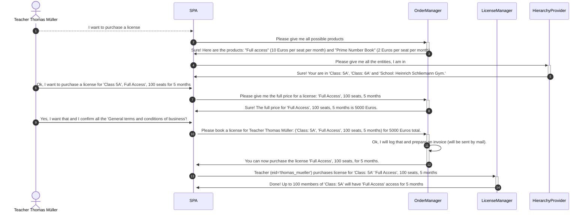
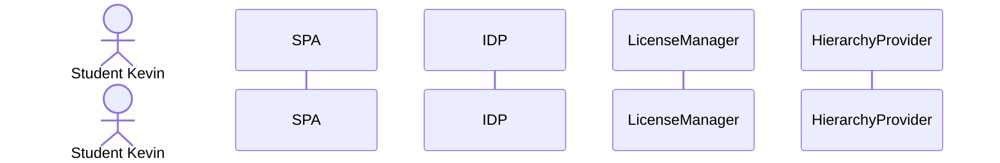

# The License Ordering and License Redeeming Process in a MultiService Environment with a SPA

A typical scenario for the new License Manager would be built up of a single page app with some
(micro) services attached. The license ordering process could be something like described below:

Redeeming a license could work like this:

