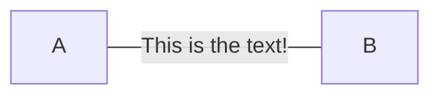

# Communication between an SPA and multiple services

In our 'licensing' scenario, we have some services, that can be separated from each other, but have
to 'communicate' with each other, either directly or using some 'indirect' way

## Direct Service-Service Communication with an SPA

## Indirect Service-Service Communication with an SPA (using signed messages)

